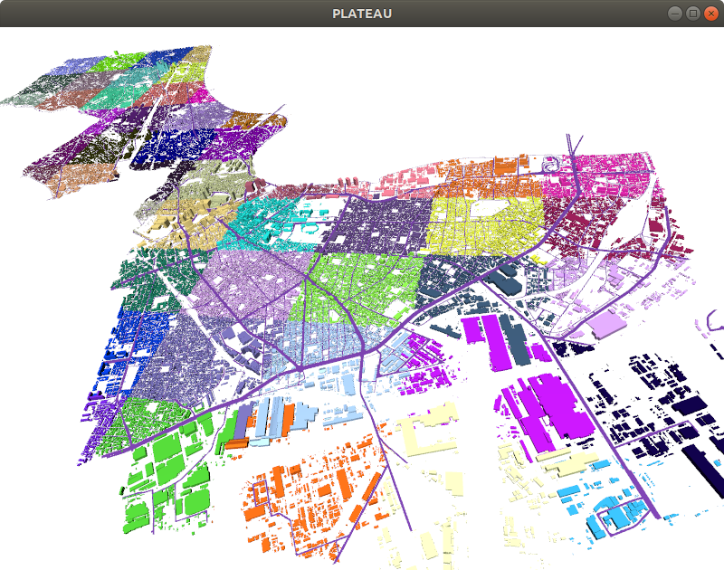

# plateaupy


[PLATEAU(CityGML)](https://www.mlit.go.jp/plateau/)のPython版パーサおよびビューア用モジュールです。  
3D表示は[Open3D](http://www.open3d.org/)または[Blender Python (bpy)](https://docs.blender.org/api/current/index.html)で行います。  

## はじめに
本ソフトウェアは、[東京23区から新しい世界を創るアイデアソン／ハッカソン](https://asciistartup.connpass.com/event/198420/)で開発されたものです。  
開発チーム： ***チーム名「影の功労者」，３名***  
 -> ハッカソンでグランプリをいただきました。このREADMEの最後に作品を紹介します。  
本リポジトリにPLATEAU(CityGML)のデータは含みません。  
ハッカソン中は非公開データでしたが、[G空間情報センター](https://www.geospatial.jp/ckan/organization/toshi)で正式公開されました。  
この公開データでも動作するよう修正しました。データダウンロードスクリプトも用意しています。  
公開データではFBXやOBJなどの３次元データも用意されましたが、本ソフトウェアはCityGMLのみから解析、３次元構築します。  

機能一覧  
* bldg(建物)のLOD 0,1,2 のパース、表示、LOD2テクスチャ表示(遅い)、メタデータのパース
* dem(地表)のパース、表示
* tran(道路)のパース、表示
* 一度パースしたデータをキャッシュしておき次回から高速読み込み
* codelists定義のパース
* Open3D TriangleMesh への変換
* Blender Object への変換
* .plyファイルへの出力

未対応  
* luse(建設予定値)のパース、表示
* brid(橋)のパース、表示、テクスチャ表示
* bldg(建物)のLOD3以上のパース、表示

## 動作環境
Python3 (Python 3.6.4, Ubuntu18.04 で確認)

## インストール
取得
>git clone --recursive https://github.com/AcculusSasao/plateaupy.git  

モジュールインストール

>cd plateaupy  
>pip install -r requirements.txt  

[Open3D v0.11.2](https://github.com/intel-isl/Open3D/releases/tag/v0.11.2) を取得しインストールしてください。  
>pip install open3d-0.11.2-***.whl
  
## PLATEAU(CityGML)データ

### PLATEAU 公開データ
[G空間情報センター](https://www.geospatial.jp/ckan/organization/toshi)で続々と公開されています。  
まずは[東京都23区](https://www.geospatial.jp/ckan/dataset/plateau-tokyo23ku)の[CityGML](https://www.geospatial.jp/ckan/dataset/plateau-tokyo23ku-citygml-2020)で確認します。データ構造が同じであれば他都市でも可能です。  

### データダウンロードスクリプト download_plateau.py
以下で東京都23区PLATEAU-CityGMLデータをダウンロードし展開します。
> python download_plateau.py plateau-tokyo23ku-citygml-2020
  
第１引数(データセット名)の文字列はヘルプで一覧を確認できます。文字列ではなくインデックス番号 0~ を指定することもできます。  
> python download_plateau.py -h

デフォルトのダウンロード/展開先は「CityGML2020/」ですが、コマンド引数 --basedir で指定することもできます。  
今後ダウンロードアドレスが変わるかもしれませんが、変更になった場合は download_plateau.py 内のアドレスを変更してください。  
以下のようなディレクトリ構成となります。  
  
CityGML2020/  
&ensp;&ensp;|  
&ensp;&ensp;plateau-tokyo23ku-citygml-2020/&ensp;&ensp;　← appviewerの-pathsで指定するパス  
&ensp;&ensp;&ensp;&ensp;|  
&ensp;&ensp;&ensp;&ensp;archive/  
&ensp;&ensp;&ensp;&ensp;&ensp;&ensp;*.zip, *.7z, ..  
&ensp;&ensp;&ensp;&ensp;codelists/  
&ensp;&ensp;&ensp;&ensp;&ensp;&ensp;*.xml, ..  
&ensp;&ensp;&ensp;&ensp;metadata/  
&ensp;&ensp;&ensp;&ensp;&ensp;&ensp;*.xml, ..  
&ensp;&ensp;&ensp;&ensp;specification/  
&ensp;&ensp;&ensp;&ensp;&ensp;&ensp;*.png, ..  
&ensp;&ensp;&ensp;&ensp;udx/  
&ensp;&ensp;&ensp;&ensp;&ensp;&ensp;bldg/,brid/,dem/,frm/,luse/,tran/, ..  

## ビューアアプリ appviewer の使い方
以降のコマンド実行で、上記PLATEAUデータの場所をコマンド引数 -paths で指定する必要があります。  
例： -paths CityGML2020/plateau-tokyo23ku-citygml-2020  
または、appviewerはデフォルトでパス path_to_citygml を参照するため、リンクを作成することで -paths の指定が不要になります。
> ln -s CityGML2020/plateau-tokyo23ku-citygml-2020  path_to_citygml

1. 区画番号(メッシュコード)一覧を表示します。  
>python appviewer.py -cmd locations  

以下が表示されます。  

>locations:  [533925, 533926, 533934, 533935, 533936, 533937, 533944, 533945, 533946, 533947, 533954, 533955, 533956, 533957]
  
  
2. 区画番号 533925 の、建物(bldg)・道路(tran)・地面(dem) を表示します。-locを指定しなければ全区画を対象としますが時間がかかります。  

>python appviewer.py -loc 533925  

読み込みにしばらく時間がかかります。  
成功するとOpen3Dの3D画面が起動し、マウス操作できます。ESCキーで終了します。  


3. 一度読み込んだデータはキャッシュファイルに保存し、次回以降はコマンドオプション -c を使用することで高速に起動します。  

>python appviewer.py -loc 533925 -c  

4. オプション -k で、gml種類 0:bldg, 1:dem, 2:luse, 3:tran 4:brid を指定できます。  

>python appviewer.py -loc 533925 -c -k 0  

5. オプション -lod2texture でLOD2のテクスチャを表示します。ただし動作が非常に遅いため場所を限定したほうが良いです。  

>python appviewer.py -paths ../CityGML_02 -k 0 -loc 53392633 -lod2texture

6. オプション -plypath [ディレクトリ] で、[ディレクトリ]に .ply ファイルを保存します。
>python appviewer.py -loc 533925 -c -plypath tmp

7. コマンドdumpmetaで、bldg内のメタデータを表示します。  

>python appviewer.py -loc 533925 -c -cmd dumpmeta  

8. コマンドcodelistsで、codelists定義を表示します。  

>python appviewer.py -cmd codelists

## Blender-Python

### Blender-Python インストール

[blender/blendertest.sh](blender/blendertest.sh)を参考にしてください。  
Blender 2.91.2 で確認しています。2.8以降bpyの仕様が大きく変わったため、少なくとも2.8以降である必要があります。  
Blender-Python(bpy)はBlender内のPythonで実行されるため、このPythonに必要モジュールをインストールする必要があります。  
Blenderのインストールディレクトリを $BLENDER とすると、まずはpipと必要モジュールをインストールします。  

>BLENDER_PYTHON=$BLENDER/2.91/python/bin/python3.7m  
>$BLENDER_PYTHON -m ensurepip  
>BLENDER_PIP=$BLENDER/2.91/python/bin/pip3  
>$BLENDER_PIP install --upgrade pip  
>$BLENDER_PIP install lxml open3d opencv-python  

### Blender-Python 実行

>$BLENDER/blender --python [blender/blendertest.py](blender/blendertest.py) --python-use-system-env

内容は[blender/blendertest.py](blender/blendertest.py)を参考にしてください。  
args を必要に応じて修正します。  
またBlender表示時にオブジェクト座標をCityGMLのXYZ[meter]そのままだと見づらいため、  
中心位置を vbase という変数に示す値に移動して、表示しています。  

## 課題

既知の不具合・課題 (取消線は解決済)
1. 緯度経度->直交座標変換が、おそらく正確ではない  plutils.py 内 convertPolarToCartsian()
2. 1.と関係するかもしれないが、おそらく、建物・地面・道路の位置が微妙にずれている。(気のせいかもしれない)
3. ~~建物のポリゴンの法線方向が逆のものがあり、建物の壁が表示されないものがある。~~
4. 道路(tran)の位置情報は高さが全てゼロで、地面(dem)の情報を引っ張ってこなければならない。

あると良さそうなもの
1. 衛星画像をテクスチャとして地面に貼り付ける
2. 動作高速化 (ポリゴン読み込みコードの最適化、ポリゴン数の削減など)
3. [東京公共交通オープンデータ](https://tokyochallenge.odpt.org/)APIの利用

## plateaupyモジュール の説明

1. plparserで与えられたパスから.gmlを検索します。この時点では解析は行いません。

```
import plateaupy  
pl = plateaupy.plparser(paths=['path_to_citygml'])  
```

* pl.locations にメッシュコード一覧がリストとして格納されます。
* pl.codelists にcodelists定義が辞書として格納されます。

2. .gmlを解析します。引数で解析対象を変更できますので、appviewer.pyの使用法を参考にしてください。

```
pl.loadFiles()
```

* pl.bldg に建物情報が辞書として格納されます。
* pl.dem に地表情報が辞書として格納されます。
* pl.tran に道路情報が辞書として格納されます。

bldg, dem, tran のクラスである plbldg, pldem, pltran は plobjクラスを親クラスとしています。plobjのメンバmeshesには、クラスplmeshのリストとして、解析したポリゴンデータが格納されます。このplmeshにはOpen3DのTriangleMeshや、BlenderのObjectに変換するメンバ関数があります。  

3. 読み込んだ.gmlの全てをOpen3DのTriangleMeshに変換して取得することができます。

```
meshes = pl.get_Open3D_TriangleMesh()
```

4. Open3DのVisualizerをラップした表示用クラスを用意しています。

```
from plateaupy.plvisualizer import Visualizer3D  
vi = Visualizer3D()  
for mesh in meshes:  
	vi.vis.add_geometry(mesh)  
while True:  
	key = vi.wait(1)  
	if key == 27:	# ESC  
		break  
```


## ライセンス
[MIT License](LICENSE.txt)  
  
使用している外部モジュールは各々のライセンスに従ってください。  
* earcut-python  
https://github.com/joshuaskelly/earcut-python  

# 各都市の表示例
大阪 513573  
  
大阪 523503  
  
横浜 533915  
  
川崎 533925  
  
横須賀 523975  
  
箱根 523960  
  


## Appendix : ハッカソンで開発した作品「都市SYM」

[](http://www.youtube.com/watch?v=2o--uUFSiZ8 "PLATEAU 3D people flow")

plateaupyを用いた大規模3D人流シミュレータです。建物は黒のワイヤーフレーム、人は色の付いたキューブで表されています。以下のようにPLATEAU情報を利用しています。応用例として例えば、災害避難時の経過時間やボトルネックの場所分析、をすることができます。

* 道路(tran)を画像解析して交差点と道を認識し、最短経路探索。
* 建物用途(usage)ごとに色を変え、人が現在いる建物、あるいは向かっている建物の用途の色を、人の色として表示。
* 建物の床面積や階数情報から、建物の各階に入室可能な人の容量を制限。

